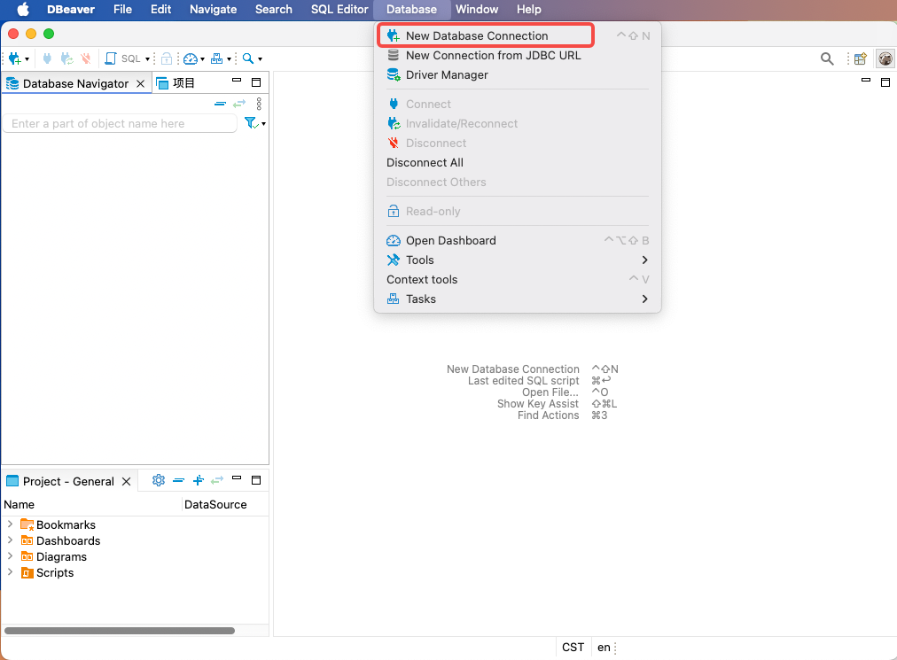
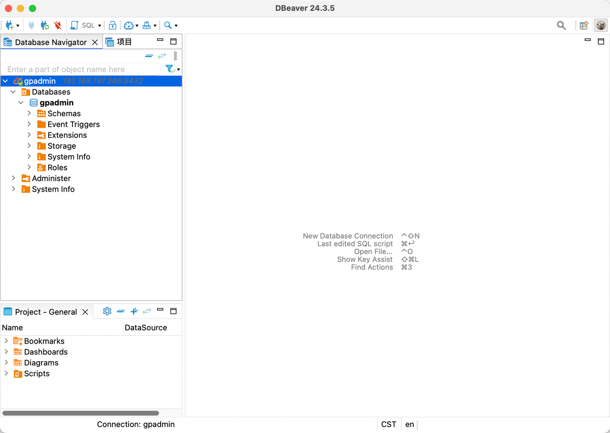

# DBeaver

DBeaver is a powerful database management tool and SQL client software that supports various database systems, including MySQL, PostgreSQL, and Apache Cloudberry. This document introduces how to establish a connection between DBeaver and the Apache Cloudberry database.

## Prerequisites

- Apache Cloudberry is deployed with proper database access permissions set in `pg_hba.conf`.
- DBeaver (v24.3.3 or higher) is installed.

## Steps

1. Launch DBeaver and start creating a new database connection using either of these methods:

    - Select **Database** > **New Database Connection** from the menu bar.

    - Click the plus (+) icon in the top-left corner.

2. In the **Select your database** dialog, find and select **Cloudberry**, then click **Next**.

3. In the **Connection Settings** dialog's **Main** tab, fill in these connection parameters:

    - **Host**: Enter the hostname or IP address of your Cloudberry database server.
    - **Port**: Enter the database port (for example, `5432`).
    - **Database**: Enter the target database name.
    - **Username**: Enter a database username with access privileges.
    - **Password**: Enter the corresponding password.

    Switch to the **Driver properties** tab to view and modify Cloudberry driver properties by clicking the Value column.

4. Verify and complete the configuration: Click **Test Connection** to test the connection. A confirmation dialog indicates a successful test. Click **OK** to confirm, then click **Finish** to complete the setup.

5. After establishing the connection, you can see the created database connection in the left navigation pane and manage your database through DBeaver.

