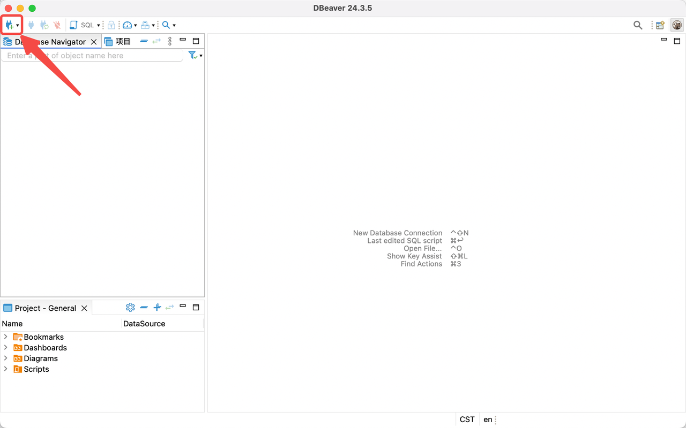
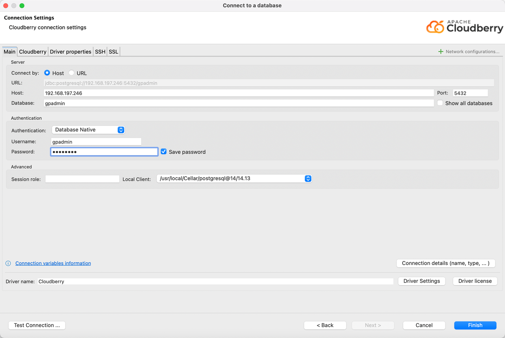
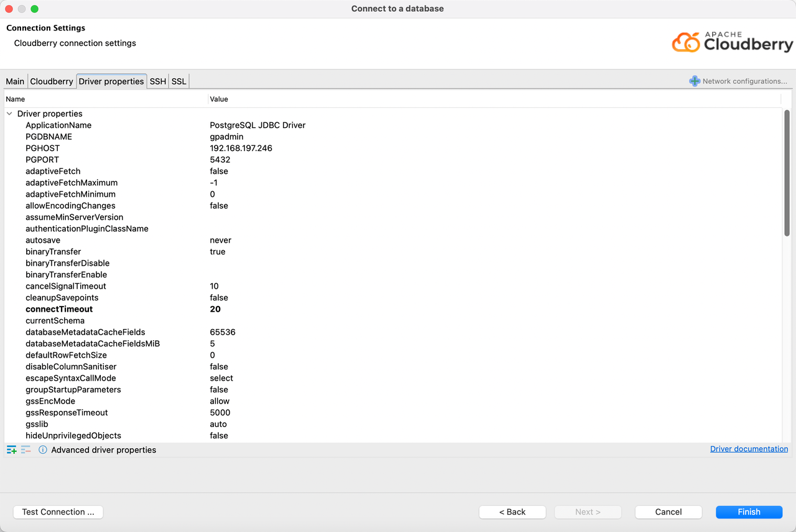

# DBeaver

DBeaver 是一款功能丰富的数据库管理工具和 SQL 客户端软件，可以支持包括 MySQL、PostgreSQL 和 Apache Cloudberry 在内的多种数据库系统，为用户提供了全面的数据库管理能力。本文将介绍如何使用 DBeaver 与 Apache Cloudberry 数据库建立连接。

## 前提条件

- 完成 Apache Cloudberry 的部署，并已在 `pg_bha.conf` 中正确设置数据库访问权限。
- 完成 DBeaver（v24.3.3 或更高版本）的安装。

## 操作步骤

1. 启动 DBeaver，通过以下两种方式之一开始创建新的数据库连接：

    - 在菜单栏选择 **Database** > **New Database Connection**

    - 点击界面左上角的加号 (+) 图标

2. 在弹出的 **Select your database** 对话框中，找到并选择 **Cloudberry**，继续点击 **Next**。

3. 在 **Connection Settings** 对话框的 **Main** 标签页中，填写以下连接参数：

     - **Host**: 输入 Cloudberry 数据库服务器的主机名或 IP 地址。
     - **Port**: 输入数据库服务端口（例如 `5432`）。
     - **Database**: 输入要连接的目标数据库名称。
     - **Username**: 输入具有访问权限的数据库用户名。
     - **Password**: 输入对应用户的登录密码。

    切换到 **Driver properties** 标签页，你可以查看并修改 Cloudberry 驱动程序的相关属性，只需点击属性对应的 Value 列即可进行编辑。

4. 验证并完成配置：点击左下角的 **Test Connection** 按钮测试连接是否可用。如果出现确认对话框，表示连接测试成功。点击 OK 确认后，最后点击 Finish 按钮完成整个连接设置。

5. 数据库连接建立以后，你可以在左侧的数据库连接导航看到已创建的数据源连接，并且可以通过 DBeaver 连接并管理数据库。

